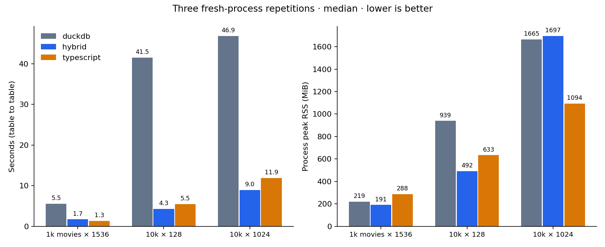

# Three-way UMAP findings — 2026-09-14

The selected hybrid has since gained an owned TypeScript optimizer and a larger
real-data accuracy check. See [the current hybrid findings](HYBRID.md); the
measurements below preserve the original comparison.

**Recommendation: continue with a TypeScript layout optimizer, using the hybrid
approach as the main development direction.** Full TypeScript is a viable,
simpler alternative, and sometimes uses less memory. The evidence does not
justify continuing to optimize the all-SQL layout as the intended default.

This follow-up compares the existing DuckDB prototype with a DuckDB graph plus
TypeScript layout, and an entirely TypeScript UMAP pipeline. All methods start
and end with a DuckDB table because that is SDA's existing storage model.
UMAP-JS 1.4.0 supplies the same layout optimizer to both TypeScript variants.
The adapter is benchmark-only. The final core method is documented in
[the public integration report](PUBLIC.md).

See [methodology and commands](compare/README.md),
[portable observations](results/three-way.json), and
[projection comparisons](results/three-way.png). The original SQL experiment is
preserved in [its historical findings](FINDINGS.md).

## Performance

Median of three fresh-process runs on Apple M4 Max / 64 GiB / macOS arm64, Deno
2.9.6, DuckDB 1.5.5. All fits use 200 epochs and one DuckDB thread. Time
includes validation, graph construction, transfer, optimization, and writing
coordinates back. It excludes loading the input table and exporting validation
artifacts. RSS is the native process high-water mark at operation completion,
including the resident input and runtime, rather than incremental memory.

| Input                          |              DuckDB |             Hybrid |          TypeScript |
| ------------------------------ | ------------------: | -----------------: | ------------------: |
| 1,000 movie embeddings × 1,536 |    5.55 s / 219 MiB |   1.71 s / 191 MiB |    1.34 s / 288 MiB |
| 10,000 vectors × 128           |   41.49 s / 939 MiB |   4.30 s / 492 MiB |    5.46 s / 633 MiB |
| 10,000 vectors × 1,024         | 46.86 s / 1,665 MiB | 8.95 s / 1,697 MiB | 11.87 s / 1,094 MiB |

The main comparison uses exact DuckDB neighbors at 1,000 rows and HNSW at
10,000; full TypeScript uses NN-descent throughout. Switching the movie hybrid
to HNSW reduces its median to **0.74 seconds**, with **478 MiB** peak RSS. The
equivalent single SQL HNSW control takes 4.41 seconds / 490 MiB. The neighbor
search choice matters; full TypeScript does not win every small-input timing.

Timing ranges at 10,000 × 1,024 were 44.39–47.04 seconds (SQL), 8.51–9.05
(hybrid), and 11.76–12.07 (TypeScript). Corresponding RSS ranges were
1,647–1,989, 1,471–1,750, and 1,091–1,304 MiB. Memory varies more than time; do
not interpret small median differences as precise allocator guarantees.

The SQL layout takes about 40 seconds at 10,000 rows, compared with roughly
2.5–2.9 seconds for either UMAP-JS layout. At 10,000 × 1,024, the hybrid graph
transfer is about 0.09–0.10 seconds and full vector transfer about 0.20–0.22
seconds. Transfer is measurable, but it is not the dominant cost here. Native
HNSW construction and the TypeScript NN-descent/fuzzy-graph implementation have
different time and memory costs. Hybrid is faster at both 10,000-row sizes; full
TypeScript uses less memory at the higher-dimensional size.

## Stress tests

With the common default budgets (1 GB DuckDB buffers, 2 GB DuckDB spill, 2,048
MiB V8 old-space, a 4 GiB process-RSS guard, and a 120-second deadline):

| Input           | DuckDB                                        | Hybrid                               | TypeScript                                              |
| --------------- | --------------------------------------------- | ------------------------------------ | ------------------------------------------------------- |
| 100,000 × 128   | Buffer-memory failure after two layout epochs | Completed: 69.27 s / 2,157 MiB       | JavaScript heap failure during fuzzy graph construction |
| 100,000 × 1,024 | Spill-limit failure during neighbors          | Spill-limit failure during neighbors | JavaScript heap failure during neighbors                |

These are resource-policy outcomes on the generated data, not universal row
limits. The limits constrain different allocators, so the common RSS guard does
not make each internal memory budget equivalent. The bounded larger-heap
TypeScript control raised V8 old-space to 3,072 MiB and **completed in 106.08
seconds at 3,167 MiB RSS**, retaining the same four-GiB RSS guard and deadline.
Thus TypeScript's initial failure was a heap-budget failure, not an inherent
100,000-row limit. Hybrid was still faster and used less memory on this case.
Both completed 100,000-row results passed finite-coordinate and source-row
preservation checks; projection quality at that size was not evaluated.

## Quality

Trustworthiness at ten neighbors, with identical starting coordinates for the
three candidates; higher is better. The reference column uses umap-learn
0.5.9.post2 with its normal spectral initialization. The saved evidence also
includes reference optimization using each candidate's graph and initialization.

| Dataset / setting                          | DuckDB | Hybrid | TypeScript | Reference |
| ------------------------------------------ | -----: | -----: | ---------: | --------: |
| Swiss roll                                 |  0.991 |  0.998 |      0.998 |     0.998 |
| Gaussian groups                            |  0.960 |  0.959 |      0.959 |     0.961 |
| Movie embeddings                           |  0.829 |  0.817 |      0.824 |     0.818 |
| Movies, five neighbors / min distance zero |  0.768 |  0.839 |      0.852 |     0.841 |
| Movies, seed 99                            |  0.824 |  0.822 |      0.824 |     0.820 |

Both TypeScript variants meet the comparison's reference-relative quality gates
on these settings. SQL misses the trustworthiness gate in the small-neighborhood
case by more than 0.07 relative to reference. On that case, neighbor overlap is
0.249 for SQL, 0.281 for hybrid, 0.288 for TypeScript, and 0.285 for reference.
The alternatives remove that observed quality weakness, although SQL sometimes
scores slightly higher on the default settings.

Learning-rate controls do not reverse the direction of the result. Setting SQL
to rate 1 gives movie trustworthiness 0.808; setting hybrid and TypeScript to
0.1 gives 0.840 and 0.830 respectively, at similar runtimes to their defaults.
There is scope for tuning, but this is not enough evidence to select one
universal learning rate. The primary comparison retains the preselected rates.

DuckDB and hybrid graph edge support matches the exact reference on all small
cases; maximum edge-weight error is about 7.2e-6 for default movies and 1.7e-5
with five neighbors. TypeScript's NN-descent graph is a different approximation:
movie edge recall is 97.4% by default and 77.6% with five neighbors. The latter
still yields strong measured projection quality, but it must not be described as
equivalent graph construction. HNSW and exact DuckDB graphs/coordinates match on
the movie controls; this is not a general HNSW recall guarantee.

All three approaches produce byte-identical movie coordinates across their three
fresh-process repetitions. The 10,000-row repetitions also produce the same
sampled quality scores. No cross-platform or cross-version determinism claim is
made.

At 10,000 rows, trustworthiness estimated from 256 fixed anchors is about
0.949–0.953 for all three. Original-neighbor overlap is only 0.019–0.041. Those
generated high-dimensional groups mainly demonstrate preservation of broad
groups, not fine local neighborhoods. There is no reference-layout quality gate
at that size. A larger real-embedding dataset remains necessary before claiming
general quality or scale support. The plots show local projections; distances
between apparent groups do not establish semantic or global geometric
relationships.

## What to do next

1. Retain DuckDB neighbor search and fuzzy-graph construction. They already
   agree closely with the reference on the checked cases. The hybrid is about
   9.7 times faster than SQL at 10,000 × 128, and 5.2 times faster at 10,000 ×
   1,024, with comparable or better measured local quality.
2. Replace the intended SQL layout with a small internal TypeScript module
   accepting weighted edges and returning coordinates. Keep the current UMAP-JS
   adapter as a benchmark reference: it uses private package methods and should
   not become the production interface. An owned implementation could remain
   dependency-free in core; reusing a runtime library would place the
   integration in the SDA extension under the repository's package rules.
3. Keep the full TypeScript path as the simpler alternative to compare against.
   It is entirely practical at the tested 1,000–10,000-row sizes, avoids VSS,
   and uses less memory at 10,000 × 1,024. If supporting those sizes with
   minimal integration work is the priority, normal UMAP-JS in the SDA extension
   is a reasonable first delivery. The hybrid offers stronger scaling evidence
   here.
4. Before publishing a public method, validate the actual production optimizer
   with these fixtures and benchmarks, and add a larger real-embedding quality
   case. The current work answers the implementation-direction question; it does
   not establish broad supported-size or parameter guarantees.

## Verification

The comparison ran 53 fits, including repetitions, parameter/search controls,
and bounded failures. Every successful worker checked finite coordinates and
preservation of source IDs/vectors. A unit test verifies identical output from
the private graph adapter and the public UMAP-JS fit path when graph, initial
coordinates, and random stream are held equal. The sampled trustworthiness
formula is checked against scikit-learn with every row used as an anchor.

`deno fmt --check`, `deno lint`, and type checks for the public entry point,
comparison workers, and prototype tests pass. The full test suite run with
`GITHUB_ACTIONS=true deno test -A --fail-fast` reports **1,658 passed, zero
failed, seven ignored**, using the existing CI skips for network-dependent
tests. These counts describe the comparison milestone.
