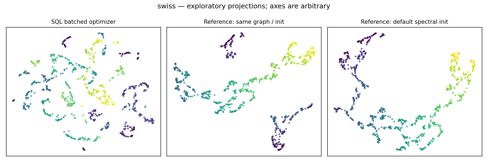
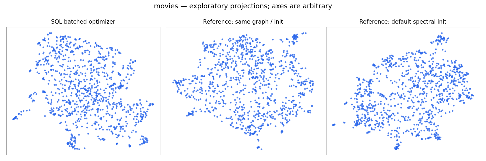

# UMAP feasibility findings — 2026-09-14

These are the historical SQL-only findings. The later
[three-way comparison](COMPARISON.md) supersedes the development recommendation
below with evidence from hybrid and fully TypeScript implementations.

**Recommendation: refine the SQL implementation before exposing a public
method.** Both algorithm stages work in DuckDB, and the prototype produces
useful local neighborhood preservation on 1,000-row examples. It is not ready to
promise a general UMAP implementation: the batched optimizer is much slower than
reference SGD, quality is sensitive to parameters, and the 100,000-row
experiments hit the configured resource limits. A native extension remains a
separate option to evaluate, not an assumed next deliverable.

The implementation is isolated in `benchmarks/umap/`, excluded from publishing.
There are no changes to the public API, package runtime dependencies, or
charting. See [commands and algorithm details](README.md) and the committed
[observation snapshot](results/observations.json).

## Environment and methodology

Apple M4 Max, 16 logical CPUs, 64 GiB RAM, macOS arm64, Deno 2.9.6, DuckDB
1.5.5, VSS `b833341`. Every SQL job used one DuckDB thread, a 1 GB buffer limit,
and a 2 GB spill limit. Limits are decimal GB; RSS below is reported in MiB.
Each observation used a fresh process, with a SQL interrupt at the configured
deadline and a parent-process kill five seconds later. Default settings were 15
neighbors, 200 epochs, seed 42, min distance 0.1, learning rate 0.1, five
negative samples, and one batch per epoch.

These are individual exploratory measurements on a shared development machine,
not repeated, isolated-machine performance estimates. Some validation work ran
concurrently. Times exclude input generation/loading and output export; stage
timings separate validation, neighbors (including index creation), fuzzy graph,
and layout. Process peak RSS includes input loading and exports. DuckDB's memory
limit does not cap every native/process allocation. The RSS unit conversion was
cross-checked against macOS `/usr/bin/time -l` (94.8 MB before exit versus 95.0
MB at exit in a small check).

Reference validation used umap-learn 0.5.9.post2 with the pinned Python
requirements. Reference timings exclude JIT warmup, which is recorded
separately. The reference optimizer consumes the same weighted graph and initial
coordinates; it retains its normal learning rate of 1.0. Full reference UMAP
uses its default spectral initialization. Python dependencies are
development-only.

## Graph correctness and duplicate handling

Small committed Euclidean and cosine fixtures agree with reference UMAP's fuzzy
graph, including duplicate vectors. On the default 1,000-row datasets, maximum
absolute edge-weight differences were approximately 2.0e-6 (Swiss roll), 2.3e-6
(blobs), and 7.2e-6 (movie embeddings). Graph edge support matched exactly on
these datasets for both exact and HNSW search. This is evidence on these
samples, not a general guarantee of HNSW recall.

The comparison supplies DOUBLE-computed distances, rounded to float32, to the
unmodified reference fuzzy-graph routine. Identical vectors are explicitly given
distance zero in both implementations. This matters: ordinary float32 cosine
calculation returned positive distances around 2e-7 to 5e-7 for some identical
movie vectors. UMAP then treated that rounding error as the first positive
neighbor distance (`rho`), producing large changes in weights. Comparing raw
float32 graphs without isolating this effect initially produced differences
above 0.6. This is a documented distance-precision/duplicate policy, not
evidence that the reference fuzzy-graph formula was replaced. Full reference
UMAP comparisons retain the library's ordinary distance behavior.

Seeded exact runs produced byte-identical coordinate CSVs in independent
processes. Tests also reverse physical input ordering while keeping ids fixed.
The default movie exact and HNSW runs produced identical graphs and coordinates.
Changing the seed changes coordinates. No cross-version, cross-platform, or
general HNSW determinism claim is made.

## Quality at 1,000 rows

Swiss roll and five Gaussian groups were embedded isometrically into 384
dimensions. The text example is a fixed sample of 1,000 public movie-plot
embeddings with 1,536 dimensions, using cosine distance. Its dataset revision,
download SHA-256, sampled source rows, and input Parquet hashes are in the
snapshot. Trustworthiness and nearest-neighbor overlap use 10 neighbors; higher
is better.

| Dataset          | SQL trustworthiness | Reference, same graph/init | Reference, spectral init | SQL neighbor overlap | Reference, spectral overlap |
| ---------------- | ------------------: | -------------------------: | -----------------------: | -------------------: | --------------------------: |
| Swiss roll       |               0.981 |                      0.998 |                    0.998 |                0.726 |                       0.763 |
| Gaussian groups  |               0.960 |                      0.958 |                    0.961 |                0.337 |                       0.325 |
| Movie embeddings |               0.837 |                      0.817 |                    0.818 |                0.270 |                       0.249 |

The default exact SQL runs took 3.86, 4.14, and 5.72 seconds, with peak RSS of
184, 195, and 219 MiB respectively. Their layout stages took approximately
3.57–4.22 seconds, versus 0.24–0.29 seconds for the warm reference optimizer.
Full reference UMAP took approximately 0.49–1.00 seconds after warmup.

The predeclared runtime and memory gates passed at this size. The synthetic data
passed the local-quality gates. **The text data failed the absolute 0.90
trustworthiness gate; reference UMAP also falls below it.** SQL exceeded
reference on this sample, but that does not establish generally better quality
or justify silently relaxing the gate after seeing the results.

The Swiss-roll plot also shows greater fragmentation in the SQL result. Local
metrics alone do not establish good global organization. Images illustrate this
limitation; matching pictures was not an acceptance criterion.

## Parameter sensitivity

All rows below use the same 1,000 movie vectors and 200 epochs. Other settings
remain at the defaults unless shown.

| Change                         | SQL trustworthiness | Reference, spectral | SQL seconds |
| ------------------------------ | ------------------: | ------------------: | ----------: |
| Default                        |               0.837 |               0.818 |        5.72 |
| 5 neighbors, min distance 0    |               0.762 |               0.841 |        4.68 |
| 30 neighbors, min distance 0.5 |               0.791 |               0.769 |        6.73 |
| 8 batches per epoch            |               0.832 |               0.818 |       14.29 |
| Learning rate 1.0              |               0.808 |               0.818 |        5.51 |
| Seed 99                        |               0.828 |               0.820 |        6.02 |

The local configuration loses about 0.079 trustworthiness relative to reference,
failing the 0.03 relative-quality gate. Eight batches were slower without a
useful quality improvement here. This is a small, non-exhaustive exploration; it
does not establish optimal defaults. It supports keeping the experimental
options private.

## Scaling and memory

Final HNSW path, using generated high-dimensional groups:

| Rows × dimensions | Neighbor seconds | Fuzzy-graph seconds | Layout seconds | Peak RSS MiB | Outcome                                                            |
| ----------------- | ---------------: | ------------------: | -------------: | -----------: | ------------------------------------------------------------------ |
| 1,000 × 128       |             0.07 |                0.08 |           4.06 |          203 | 200 epochs completed                                               |
| 1,000 × 1,024     |             0.19 |                0.09 |           4.17 |          351 | 200 epochs completed                                               |
| 10,000 × 128      |             1.06 |                0.42 |          38.56 |          949 | 200 epochs completed                                               |
| 10,000 × 1,024    |             5.28 |                0.38 |          39.57 |        1,651 | 200 epochs completed; spilled data                                 |
| 100,000 × 128     |            39.71 |                3.64 |              — |        1,865 | Memory allocation failure after 2 completed epochs                 |
| 100,000 × 1,024   |                — |                   — |              — |        1,760 | Spill limit reached during neighbor stage, after about 101 seconds |

The exact path at 10,000 × 128 completed in 47.89 seconds, including 6.72
seconds for neighbors. At 10,000 × 1,024, exact neighbors took 54.67 seconds;
the 60-second deadline interrupted layout after 24 completed epochs. Exact
search uses bounded top-k heaps but still performs quadratic distance work.

At 10,000 × 128, the final HNSW graph's raw numeric payload was only 3.21 MiB.
The last layout batch nevertheless materialized 400,746 gradient rows, peak RSS
reached 949 MiB, and DuckDB reported approximately 92 MiB of retained buffers
after layout. Raw sparse-graph size is a poor estimate of working memory. At
10,000 × 1,024, retained spill data after layout was about 140 MiB despite the
small graph. No layout-quality claim is made for 100,000 rows.

Two concrete SQL findings emerged:

1. DuckDB 1.5.5's `top_n_window_elimination` rewrite hid the join shape
   recognized by the installed VSS optimizer. Disabling that rewrite during
   neighbor search produces `HNSW_INDEX_JOIN`. The prototype verifies the actual
   candidate query plan and restores the previous setting afterward.
2. Ranking candidates directly after joining their vectors caused the window
   operator to retain full vectors. Materializing only ids and scalar distances
   before ranking cut the movie HNSW peak from about 1,008 to 483 MiB. It also
   changed 10,000 × 1,024 from a neighbor-stage memory failure to a completed
   run. Both earlier failures and the final measurements are retained in the
   snapshot.

## What the next decision needs

Keep the prototype unpublished. Investigate optimizer allocation/reuse and the
poor low-neighbor configuration before designing a public signature. Evaluate
whether a compiled optimizer consuming the DuckDB graph justifies a native
extension's packaging and maintenance cost. A decision to stop is also valid if
these tradeoffs do not serve SDA's intended users.

The existing tests cover reference graphs, gradients, row identity and vector
preservation, seeds and stable ordering, invalid vectors, small/duplicate data,
VSS plan selection, and restoration of optimizer settings. The core suite passed
with 1,656 tests and 7 CI-mode skips; focused prototype tests were rerun after
the final numerical changes. Formatting, lint, and type checks pass. These
counts describe the SQL prototype milestone.
