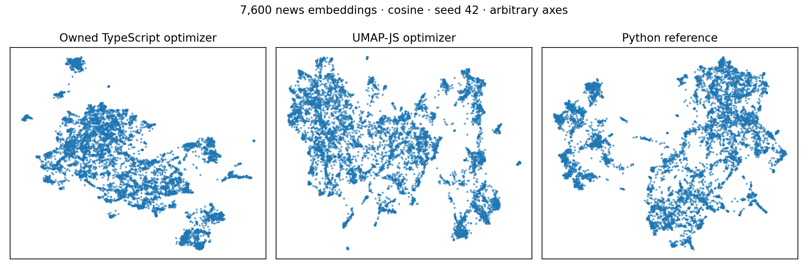

# Selected hybrid implementation — 2026-09-14

**The hybrid now has an owned TypeScript optimizer with no additional runtime
dependency. Quality remains close to Python reference UMAP, and typed arrays
substantially reduce memory at 100,000 rows.** This is the selected continuation
of the [three-way comparison](COMPARISON.md).

The executable dependency graph contains no `umap-js`; that package remains in
the earlier benchmark as a development reference. The numerical implementation
has now been promoted into the public chainable method; see
[public integration and fresh measurements](PUBLIC.md). The lab adapter retains
its dedicated scratch connection and fixed input contract.

## Implementation

DuckDB validates vectors and constructs the exact/HNSW fuzzy neighborhood graph.
Only scalar weighted edges cross into TypeScript. The new optimizer performs
sequential UMAP SGD using typed arrays for edge IDs, schedules, and coordinates,
then writes two coordinates back while preserving source IDs, vectors, and other
columns. Unused SQL scratch tables and vector copies are released before layout.

The implementation supports reproducible unsigned 32-bit seeds, continuous
minimum distances from zero through one, and cancellation during SQL or layout.
An owned two-variable least-squares solver fits the reference UMAP curve.
Initialization is random; spread and repulsion strength are one. Spectral
initialization, densMAP, supervision, and transforming new points are outside
this prototype's scope.

RNG, precision, and edge order differ from reference implementations. Coincident
negative pairs get zero gradient, matching current Python UMAP rather than
UMAP-JS 1.4.0's constant positive fallback. See the
[algorithm and reproduction notes](hybrid/README.md) for the full contract.

## Quality

All 17 small-data evaluations passed the existing reference-relative gates:
trustworthiness within 0.03 and ten-neighbor overlap within 0.10 of Python UMAP.
Thresholds were not relaxed. Cases include four additional movie seeds and
minimum distances 0.025, 0.25, 0.8, and 1.

| Dataset / setting                              | Owned hybrid trustworthiness | Python reference |
| ---------------------------------------------- | ---------------------------: | ---------------: |
| Swiss roll                                     |                        0.998 |            0.998 |
| Gaussian groups                                |                        0.958 |            0.961 |
| Movie embeddings                               |                        0.813 |            0.818 |
| Movies, five neighbors / minimum distance zero |                        0.843 |            0.841 |
| Movies, minimum distance 0.8                   |                        0.756 |            0.758 |
| Movies, minimum distance 1                     |                        0.746 |            0.748 |

Larger real-data validation covers **7,600 public AG News embeddings with 384
dimensions**, using cosine distance. Three seeds compare the owned optimizer,
the earlier UMAP-JS hybrid, and Python UMAP. Quality uses 512 fixed anchors
ranked against all 7,600 rows; these are sampled estimates, not full-population
scores or confidence intervals.

| Seed | Owned hybrid trustworthiness | UMAP-JS hybrid | Python reference | Owned neighbor overlap | Python neighbor overlap |
| ---- | ---------------------------: | -------------: | ---------------: | ---------------------: | ----------------------: |
| 42   |                        0.938 |          0.937 |            0.944 |                  0.288 |                   0.287 |
| 99   |                        0.939 |          0.938 |            0.941 |                  0.285 |                   0.288 |
| 123  |                        0.933 |          0.933 |            0.943 |                  0.288 |                   0.295 |

Every news comparison passed the same quality gates. This adds evidence on a
second real embedding dataset; it does not establish preservation of global
distances or semantic groups. The source revision, SHA-256, and model label are
pinned in `prepareNews.py`; no embedding provider or model was called.

## Performance and memory

Same Apple M4 Max, 64 GiB, Deno 2.9.6 / DuckDB 1.5.5 environment and limits: one
DuckDB thread, 1 GB buffers, 2 GB spill, 2,048 MiB V8 old-space, four-GiB RSS
guard, 200 epochs, and a 120-second deadline. Time covers the operation on an
already loaded table through coordinate writeback. Native peak RSS is recorded
before validation/export, including resident input and runtime.

| Input / search        | Earlier UMAP-JS hybrid |       Owned hybrid |
| --------------------- | ---------------------: | -----------------: |
| 1,000 movies / exact  |       1.71 s / 191 MiB |   1.69 s / 156 MiB |
| 1,000 movies / HNSW   |       0.74 s / 478 MiB |   0.82 s / 449 MiB |
| 10,000 × 128 / HNSW   |       4.30 s / 492 MiB |   4.13 s / 308 MiB |
| 10,000 × 1,024 / HNSW |     8.95 s / 1,697 MiB | 8.31 s / 1,317 MiB |
| 100,000 × 128 / HNSW  |    69.27 s / 2,157 MiB |  65.72 s / 700 MiB |

The first four rows are medians of three fresh-process fits; 100,000-row values
are individual bounded runs. Baselines come from the preceding experiment, so
small timing changes are not precise speedup estimates. The news comparison
alternated implementations across three seeds: median owned hybrid time/RSS is
4.36 seconds / 579 MiB versus 4.16 seconds / 739 MiB for UMAP-JS. The new
optimizer is not uniformly faster; memory and removal of the runtime dependency
are the main improvements.

At 100,000 × 128, graph construction takes about 37 seconds and layout about 28
seconds. Later validation/export raises the process peak to about 889 MiB,
recorded separately. Quality at that size remains unmeasured. The previously
failing 100,000 × 1,024 neighbor-search case was not rerun: its graph
construction and limits are unchanged.

## Verification and integration status

Sixteen added Deno tests check curve parameters against SciPy, six SGD traces
from the reference Python epoch routine, invalid inputs, reproducibility,
preservation of IDs/vectors/payload, reversed row order, and timer cancellation.
Trace fixtures isolate SGD from RNG/precision differences; separate quality
comparisons use normal Python UMAP. Movie coordinates repeat byte-for-byte.

Thirty additional fits completed: 24 owned hybrid runs and six news comparison
runs. [Commands](hybrid/README.md) and
[saved observations](results/hybrid-owned.json) make them reproducible. The
evaluator saves evidence and fails if a fit or quality gate fails. Formatting,
lint, and type checks passed; the full suite with the existing CI network skips
reports **1,674 passed, zero failed, seven ignored**.

The subsequent [public integration](PUBLIC.md) implements the chainable core
method with arbitrary table/column names and isolated scratch state. The figures
and test count above describe the earlier hybrid milestone.
